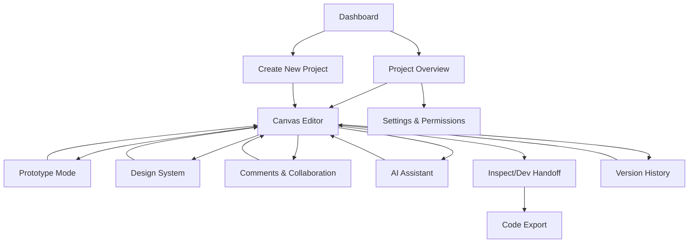

# UIForge - Product Requirements Document

## 1. Product Overview

UIForge is a collaborative, AI-assisted UI/UX design and prototyping platform for cross-functional teams. It empowers users to design, iterate, prototype, and hand off interfaces in real-time using an intelligent canvas, reusable components, and seamless team workflows.

The platform replicates and extends the functionality of Motiff, with core collaborative design features, real-time editing, AI-powered design flows, and dev handoff capabilities. Target market includes design agencies, product teams, and enterprise organizations seeking efficient design-to-development workflows.

## 2. Core Features

### 2.1 User Roles

| Role      | Registration Method | Core Permissions                                         |
| --------- | ------------------- | -------------------------------------------------------- |
| Admin     | Workspace creation  | Full workspace management, billing, user permissions     |
| Editor    | Team invitation     | Create/edit projects, manage design systems, collaborate |
| Viewer    | Share link access   | View designs, add comments, inspect code                 |
| Developer | Team invitation     | Access dev handoff, extract code, view design tokens     |

### 2.2 Feature Module

Our UIForge platform consists of the following main pages:

1. **Dashboard**: workspace switcher, project grid/list view, recent projects, AI project creation
2. **Project Overview**: project metadata, team management, canvas thumbnails, activity feed
3. **Canvas Editor**: main design workspace with collaborative editing, panels, and tools
4. **Prototype Mode**: interactive preview, device simulation, flow connections
5. **Design System**: style tokens, component library, brand assets management
6. **Comments & Collaboration**: threaded discussions, mentions, resolution tracking
7. **Settings & Permissions**: workspace configuration, role management, billing

### 2.3 Page Details

| Page Name                | Module Name                           | Feature description                                                                                                                               |
| ------------------------ | ------------------------------------- | ------------------------------------------------------------------------------------------------------------------------------------------------- |
| Dashboard                | Project Management                    | Display project grid/list with thumbnails, search/filter projects, workspace switcher dropdown                                                    |
| Dashboard                | AI Project Creation                   | Generate new projects from text prompts using OpenAI Vision API, template selection                                                               |
| Dashboard                | Recent Activity                       | Show recent projects, team activity feed, quick access to frequently used projects                                                                |
| Project Overview         | Project Metadata                      | Edit project name, description, tags, and project settings                                                                                        |
| Project Overview         | Team Management                       | Invite members, assign roles (Admin/Editor/Viewer/Developer), manage permissions                                                                  |
| Project Overview         | Canvas Thumbnails                     | Grid view of all project screens/pages with navigation, duplicate/delete actions                                                                  |
| Project Overview         | Activity Feed                         | Real-time updates of design changes, comments, version history with timestamps                                                                    |
| Canvas Editor            | Left Panel - Pages                    | List all project pages/frames, create new pages, organize page hierarchy                                                                          |
| Canvas Editor            | Left Panel - Layers                   | Z-indexed element tree, show/hide layers, lock/unlock, grouping controls                                                                          |
| Canvas Editor            | Left Panel - Assets                   | Component library, icons, images, drag-and-drop to canvas, asset search                                                                           |
| Canvas Editor            | Center Canvas                         | 2D canvas with Pixi.js/SVG rendering, zoom/pan/grid, selection tools, live cursors                                                                |
| Canvas Editor            | Canvas Collaboration                  | Real-time multiplayer editing, live user presence, synchronized cursor movements                                                                  |
| Canvas Editor            | Drag-Drop System                      | Drag components from assets panel, snap to grid/guides, resize handles                                                                            |
| Canvas Editor            | Right Panel - AI Assitant             | Chat Prompt Interface that allows users generate and reiterate design screens on the canvas using natural language prompting with Open Vision API |
| Canvas Editor            | Right Panel - Properties              | Style editor for selected elements (colors, typography, spacing, effects)                                                                         |
| Canvas Editor            | Right Panel - Overrides               | Component instance customization, maintain link to master component                                                                               |
| Canvas Editor            | Right Panel - Interactions            | Define click actions, transitions, animations, link to other screens                                                                              |
| Prototype Mode           | Flow Preview                          | Interactive preview of designed screens with clickable hotspots and transitions                                                                   |
| Prototype Mode           | Device Simulation                     | Preview designs in mobile, tablet, desktop viewports with responsive behavior                                                                     |
| Prototype Mode           | Animation Timeline                    | Create and edit transitions, micro-interactions, and animation sequences                                                                          |
| Design System            | Style Tokens                          | Manage colors, typography, spacing, effects as reusable design tokens                                                                             |
| Design System            | Component Library                     | Create, edit, and organize reusable components with variants and states                                                                           |
| Design System            | Brand Management                      | Upload logos, brand assets, manage multiple brand themes                                                                                          |
| Design System            | Import/Export                         | Import Figma libraries, export design systems, sync with external tools                                                                           |
| Comments & Collaboration | Comment Threads                       | Pin comments to canvas elements, threaded discussions, mention team members                                                                       |
| Comments & Collaboration | Resolution Tracking                   | Mark comments as resolved, filter by status, assign comment ownership                                                                             |
| Comments & Collaboration | Notifications                         | Real-time notifications for mentions, replies, and project updates                                                                                |
| AI Assistant             | Prompt Generator                      | Generate UI screens and layouts from natural language descriptions                                                                                |
| AI Assistant             | On Canvas editior- Layout Suggestions | AI-powered recommendations for improving design layouts and spacing                                                                               |
| AI Assistant             | On Canvas EditorDesign Analysis       | Analyze existing designs and suggest improvements using OpenAI Vision API                                                                         |
| Inspect/Dev Handoff      | CSS Inspector                         | Extract CSS properties from selected elements, copy styles to clipboard                                                                           |
| Inspect/Dev Handoff      | Token Extraction                      | Export design tokens as JSON, CSS variables, or platform-specific formats                                                                         |
| Inspect/Dev Handoff      | Code Export                           | Generate HTML/CSS, React JSX, or Tailwind code snippets from designs                                                                              |
| Version History          | Timeline View                         | Visual timeline of all design changes with timestamps and user attribution                                                                        |
| Version History          | Snapshot Preview                      | Preview previous versions of designs, compare changes side-by-side                                                                                |
| Version History          | Restore/Duplicate                     | Restore previous versions or create new branches from historical states                                                                           |
| Settings & Permissions   | Workspace Settings                    | Configure workspace name, default permissions, integration settings                                                                               |
| Settings & Permissions   | Role Management                       | Define custom roles, set granular permissions for different user types                                                                            |
| Settings & Permissions   | Share Links                           | Generate public/private share links with configurable access levels                                                                               |
| Settings & Permissions   | Billing Management                    | Subscription plans, usage analytics, payment method management                                                                                    |

## 3. Core Process

**Designer Workflow:**
Designers start from the Dashboard, create or open projects, use the Canvas Editor for design work with real-time collaboration, leverage AI Assistant for layout generation, organize assets in Design System, and share work via Prototype Mode.

**Developer Workflow:**
Developers access shared projects, use Inspect/Dev Handoff tab to extract CSS and design tokens, export code snippets, and collaborate through Comments system for design-development alignment.

**Team Collaboration Flow:**
Team members join workspaces, collaborate in real-time on Canvas Editor, use Comments for feedback, track changes in Version History, and manage permissions through Settings.

## 4. User Interface Design

### 4.1 Design Style

* **Primary Colors:** Bright blue (#3B82F6) for primary actions and highlights, clean white (#FFFFFF) for main backgrounds

* **Secondary Colors:** Light gray (#F1F5F9) for panel backgrounds, medium gray (#64748B) for secondary text, dark gray (#1E293B) for primary text

* **Accent Colors:** Purple (#8B5CF6) for AI features, green (#10B981) for success states, subtle borders (#E2E8F0)

* **Button Style:** Rounded corners (6px radius), clean flat design with subtle hover states, blue primary buttons

* **Typography:** Clean sans-serif font family, 14px base size, clear hierarchy with proper contrast ratios

* **Layout Style:** Minimalist design with collapsible sidebars, clean panel organization, subtle shadows and borders

* **Panel Design:** Light backgrounds with subtle borders, collapsible with smooth animations, vertical toggle controls

* **Icons:** Consistent icon set with 16-20px sizes, clean line style, proper visual hierarchy

### 4.2 Page Design Overview

| Page Name      | Module Name     | UI Elements                                                                                                             |
| -------------- | --------------- | ----------------------------------------------------------------------------------------------------------------------- |
| Dashboard      | Project Grid    | Card layout with project thumbnails, hover effects, grid/list toggle button                                             |
| Dashboard      | Navigation      | Top navigation bar with workspace switcher, search, user avatar dropdown                                                |
| Canvas Editor  | Left Sidebar    | Collapsible panel with vertical toggle button, tabs (Pages/Layers/Assets), clean white background, subtle borders       |
| Canvas Editor  | Main Canvas     | Infinite canvas with light gray background, zoom controls, grid overlay, floating toolbar, expands when panels collapse |
| Canvas Editor  | Right Sidebar   | Collapsible property panel with vertical toggle, clean layout, organized sections, AI chat interface, light backgrounds |
| Canvas Editor  | Panel Toggles   | Vertical collapse buttons on panel edges, smooth animation transitions, maintains canvas focus                          |
| Canvas Editor  | Collapsed State | Thin vertical bars when panels collapsed, quick access icons, maximum canvas viewing area                               |
| Prototype Mode | Preview Area    | Device frame mockups, play button, interaction hotspot indicators                                                       |
| Design System  | Token Manager   | Color swatches, typography samples, spacing visualizations, organized in categories                                     |
| Comments       | Comment Pins    | Floating comment bubbles on canvas, threaded reply interface, status badges                                             |

### 4.3 Responsiveness

Desktop-first design optimized for large screens (1440px+) with adaptive layouts for smaller screens. Touch interaction support for tablet devices with gesture-based canvas navigation and mobile-responsive settings panels.

### 4.4 Canvas Layout Specifications

**Collapsible Panel System:**

* Left and right sidebars can be collapsed vertically using toggle controls

* When collapsed, panels become thin vertical bars (40px width) with essential icons

* Toggle buttons positioned at the inner edge of each panel for easy access

* Smooth animation transitions (300ms) when expanding/collapsing panels

* Canvas automatically expands to fill available space when panels collapse

* Panels maintain their last state and content when re-expanded

* Keyboard shortcuts (Cmd/Ctrl + \ for left panel, Cmd/Ctrl + / for right panel)

**Canvas-Focused Design:**

* Maximum canvas viewing area when both panels are collapsed

* Clean, distraction-free interface prioritizing design work

* Floating controls and toolbars that don't interfere with canvas space

* Responsive canvas that adapts to available screen real estate

* Grid and guides system that scales with canvas zoom level

**Panel Behavior:**

* Left panel contains Pages, Layers, and Assets tabs with search functionality

* Right panel houses Properties, AI Assistant, Interactions, and Inspect tools

* Both panels feature consistent toggle controls for seamless user experience

* Collapsed panels show minimal visual indicators while preserving workspace

* Panel state persistence across sessions for improved workflow continuity

